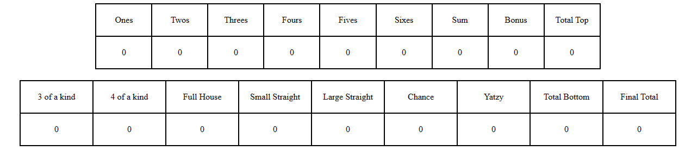

# Design Systems 

## How the game works
The game contains 5 dice, 2 buttons (Roll Dice and Start Over), and a scoreboard. The user starts by clicking on the roll dice button to roll the dice. If the user wants to keep a die, they can select it and it becomes red. If the user is satisfied with a score (which updates dynamically), they can click on the score that they want. Once a score has been selected, it becomes bold. This process will be repeated until the user has clicked every possible score. Once there are no more possible scores to click on, a game over pop up will appear with the final score and the option to start over by clicking a button.

## Colours
|Section|Hex|Color|
|-----|--------|------|
|Background|#FFFFFF| - White|
|Dice|#FFFFFF| -White|
|Dice dots| #000000|  - black|
|Buttons|#f0f0f0|  - light grey|
|Selected dice| #FF0000|  - red|
|Selected score| #000000|  - black|

## Yatzy interface

## Instructions

## Dice and buttons

## Selected dice

## Scoreboard

## Selected scoreboard

## Game over
